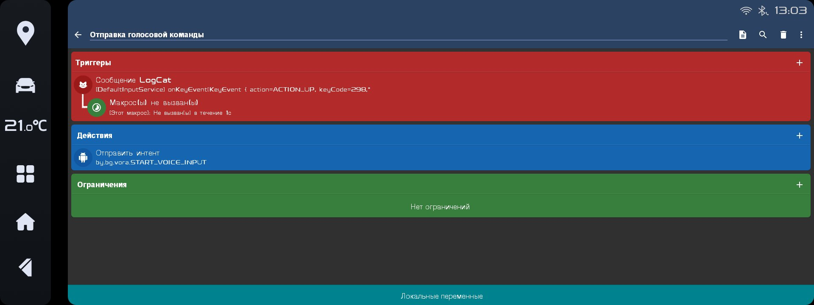
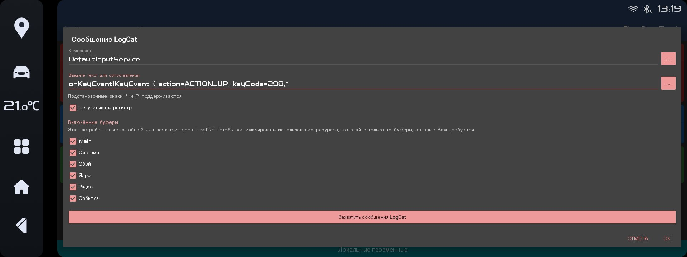
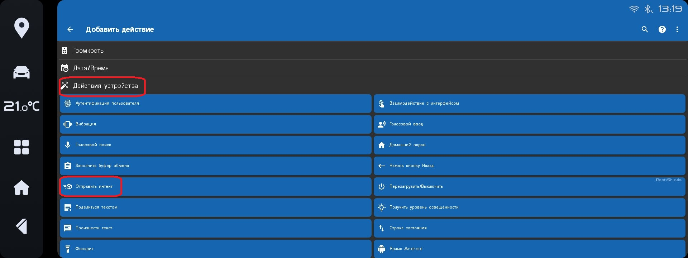
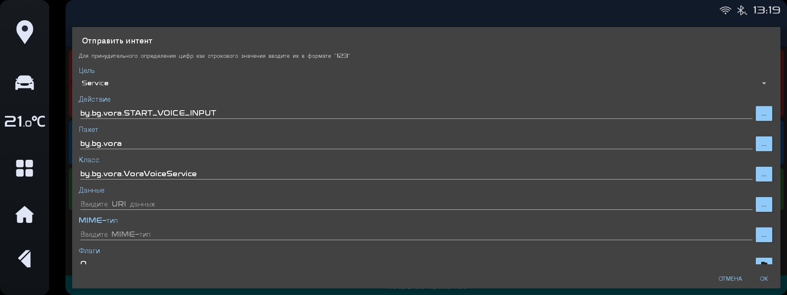
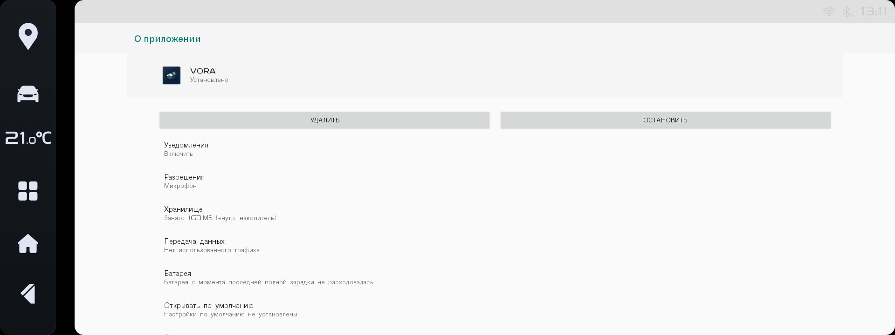
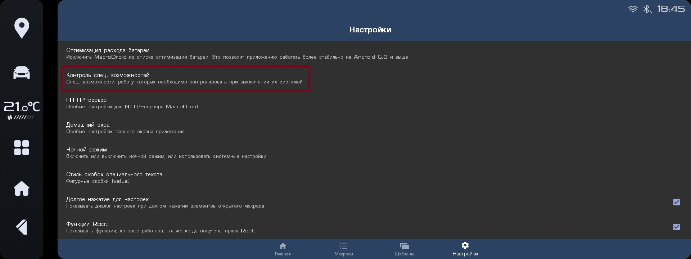

# 🚗 Инструкция по настройке голосового управления VORA

Для корректной работы приложения необходимо создать макрос и выполнить действия в настройках устройства.

---

## 1. Создание макроса в Macrodroid

Активируйте голосовое управление по нажатию на кнопку.

---

## 2. Триггер

Выберите триггер: **нажатие на кнопку голосового управления**.

---

## 3. Действие

Перейдите в **Действия устройства → Отправить интент**.

---

## 4. Настройка интента

Создайте интент согласно изображению:

- Цель: `Service`
- Действие: `by.by.vora.START.VOICE_INPUT`
- Категория: `by.by.vora.VoraVoiceService`
- Данные: `by.by.vora`

---

## 5. Сохранение макроса

Сохраните и включите макрос.

---

## ⚙️ Настройка устройства

Отключите экономию заряда, чтобы приложение не переходило в режим гибернации.

---

## 6. Отключение оптимизации батареи

Перейдите в:  
**Настройки → Приложения → VORA → Батарея**

---

## 7. Выбор режима

Выберите:  
**Экономия заряда → Все приложения → VORA → Не экономить → Готово**

---

## ✅ Завершение

На этом настройка завершена.  
Хорошего пользования 😉  
По вопросам пишите в Telegram: [@Gleb_Balashevich](https://t.me/Gleb_Balashevich)

---
