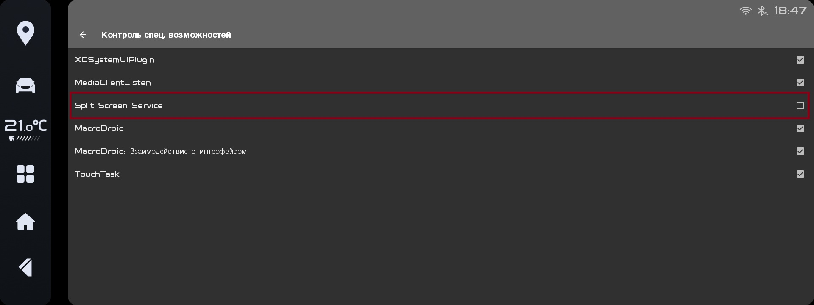

# 🚗 Инструкция по настройке голосового управления VORA

Для корректной работы приложения необходимо создать макрос для активации голосового управления по нажатию на кнопку.

---

## 🧩 Создание макроса в Macrodroid

Макрос активации голосового управления по кнопке на руле


---

### 1. Триггер

В качестве триггера выберите "Сообщение LogCat" и заполните поля в соответствии с изображением:


---

### 2. Действие

Перейдите в раздел **Действия устройства** далее → **Отправить интент**.


---

## 3. Настройка интента

Создайте интент согласно изображению:

- Цель: `Service`
- Действие: `by.bg.vora.START.VOICE_INPUT`
- Категория: `by.bg.vora.VoraVoiceService`
- Данные: `by.bg.vora`


---

## 4. Сохранение макроса

Сохраните и включите макрос.

## 5. Первый запуск

При первом запуске приложения будут запрошены все необходимые разрешения:

- **Доступ к микрофону** - для работы голосового управления
- **Отключение экономии батареи** - для бесперебойной работы в фоне  
- **Уведомление на выдачу разрешения на работу сервиса Спец. возможностей** - необходимо для запуска разделения экрана*
- 
Для корректной работы приложения необходимо выдать **все** перечисленные разрешения.

## 6. Настройка разделения экрана

### С помощью Macrodroid:
- Откройте **Macrodroid** и перейдите в раздел **Настройки**
- Выберите пункт **Контроль спец. возможностей**:

- Активируйте галочку возле **Split Screen Service**:

- Перезагрузите головное устройство (долгое нажатие на качельку громкости)

### С помощью Терминала:
- Откройте терминал
- Получите права суперпользователя:
> 
> ```code
> su
> ```
- Выполните команду для выдачи разрешения AccessibilityService:
> ```code
> settings put secure enabled_accessibility_services by.bg.vora/by.bg.vora.bootstrap.AccessibilityServiceStub
> ```

---

## ✅ Завершение

На этом настройка завершена.  
Хорошего пользования 😉  

---
